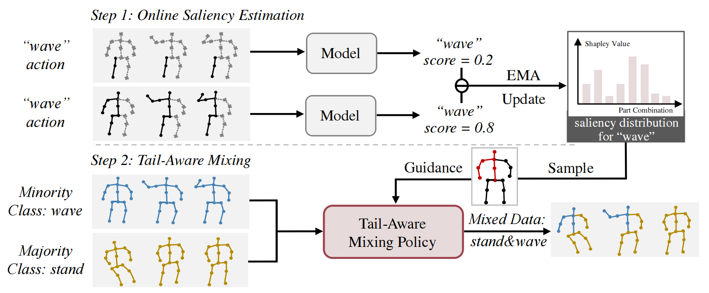

# Shap-Mix
[](https://paperswithcode.com/sota/skeleton-based-action-recognition-on-ntu-rgbd?p=shap-mix-shapley-value-guided-mixing-for-long)

[](https://paperswithcode.com/sota/skeleton-based-action-recognition-on-ntu-rgbd-1?p=shap-mix-shapley-value-guided-mixing-for-long)


This repo is the official implementation for [Shap-Mix: Shapley Value Guided Mixing for Long-Tailed Skeleton Based Action Recognition](https://arxiv.org/abs/2407.12312). The paper is accepted to IJCAI 2024. 

*This is an efficient and effective plug-in augmentation method to improve your skeleton-based action recognition model.*

## Method Overview

# Prerequisites

- Python >= 3.6
- PyTorch >= 1.1.0
- PyYAML, tqdm, tensorboardX


# Data Preparation

We follow the CTR-GCN [repo](https://github.com/Uason-Chen/CTR-GCN) to preprocess the NTU dataset and ST-GCN++ [repo](https://github.com/kennymckormick/pyskl) for the Kinectic 400 dataset.

After preprocessing, you should change the data path in config.yaml.

# Training & Testing

- Change the config file depending on what you want.
We provide two implementations for DDP mode and single GPU:

### DDP mode (NTU as example)
```
 CUDA_VISIBLE_DEVICES=4,5 python -m torch.distributed.launch --nproc_per_node 2 --master_addr 127.0.0.3 --master_port 29502  shapley_mix_main_ddp_logits_adjust.py --config config/nturgbd-cross-subject/long_tailed_logit_adjust.yaml
```

### Single GPU (K400 as example)
```
python  shapley_mix_main_k400.py --config /mnt/netdisk/zhangjh/Code/CTR-GCN-main/work_dir/k400/ctrgcn_joint/shapley_mix_len100_cos/config.yaml
```

### Pretrained Models

- The pretrained models can be found [here](https://drive.google.com/drive/folders/1XuBTaDTwdK5JB2dqqavBS_W-EUKwR1nU?usp=sharing).

## Acknowledgements

This repo is based on [CTR-GCN](https://github.com/Uason-Chen/CTR-GCN). 
The Kinectic-400 implementation is based on [ST-GCN++](https://github.com/kennymckormick/pyskl).

Thanks to the original authors for their work!

# Citation

Please cite this work if you find it useful:.

      @InProceedings{Shap_Zhang24,
          author = {Zhang, Jiahang and Lin, Lilang and Liu, Jiaying},
          title = {Shap-Mix: Shapley Value Guided Mixing for Long-Tailed Skeleton Based Action Recognition},
          booktitle = {International Joint Conference on Artificial Intelligence (IJCAI)},
          year = {2024}
      }


# Contact
For any questions, feel free to contact: `zjh2020@pku.edu.cn`
